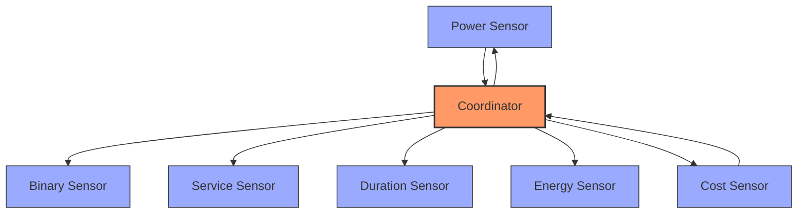

# Smart Dumb Appliance Integration: System Patterns

## System Architecture

The Smart Dumb Appliance integration follows a coordinator-based architecture pattern common in Home Assistant integrations. This architecture provides centralized data management, consistent updates, and separation of concerns.

### Key Components

1. **Coordinator (`SmartDumbApplianceCoordinator`)**
   - Central data management and calculation engine
   - Subscribes to power sensor updates
   - Maintains state for all metrics
   - Handles all business logic and calculations
   - Provides data to all sensor entities

2. **Sensors**
   - Binary Sensor: Tracks appliance running state
   - Service Sensor: Tracks maintenance status
   - Power Sensor: Reports current power consumption
   - Duration Sensor: Tracks cycle duration
   - Energy Sensor: Tracks energy consumption
   - Cost Sensor: Tracks energy cost

3. **Config Flow**
   - Handles user configuration
   - Validates input parameters
   - Creates and manages config entries

## Key Technical Decisions

### 1. Coordinator-Based Architecture
**Decision**: Use a dedicated coordinator to manage all state and calculations.  
**Rationale**: 
- Centralizes all business logic in one place
- Ensures consistent state across all entities
- Simplifies entity code
- Follows Home Assistant best practices
- Supports more efficient updates

### 2. Sensor Inheritance Pattern
**Decision**: Use a base sensor class with specialized subclasses.  
**Rationale**:
- Reduces code duplication
- Ensures consistent behavior across sensors
- Simplifies maintenance and updates
- Provides clear separation of concerns

### 3. Deferred Initialization
**Decision**: Implement a startup delay and retry mechanism.  
**Rationale**:
- Ensures dependencies (e.g. power sensors) are available
- Improves reliability on system restart
- Handles race conditions more gracefully
- Provides better error feedback

### 4. Entity Registry Management
**Decision**: Manage entity cleanup and name updates explicitly.  
**Rationale**:
- Ensures proper cleanup during removal
- Handles device renames correctly
- Prevents orphaned entities
- Improves user experience during configuration changes

## Design Patterns

### Observer Pattern
- Coordinator acts as the observable
- Sensors act as observers
- Updates flow from coordinator to sensors via callbacks
- Ensures data consistency across all entities

### Strategy Pattern
- Different sensor types handle different aspects of the same data
- Each sensor implements its own display strategy
- Common data but different presentations

### Factory Pattern
- Config entries create coordinators
- Coordinators create sensor entities
- Standardized creation process

### State Machine
- Power state transitions (off → on → off)
- Service status transitions (ok → needs_service → disabled)
- Debounce logic prevents rapid state changes

## Component Relationships

### Data Flow

1. **Power Sensor → Coordinator**
   - External power sensor state changes
   - Coordinator receives power updates
   - Coordinator calculates derived metrics
   - Coordinator maintains state

2. **Coordinator → Entity Sensors**
   - Coordinator notifies entities of updates
   - Entities read data from coordinator
   - Entities format data for display
   - Entities provide user interface

3. **Config Entry → Coordinator**
   - Config entry provides configuration
   - Coordinator uses configuration for calculations
   - Configuration changes update coordinator behavior
   - Coordinator adapts to new settings

### Dependencies

- **External Dependencies**:
  - Home Assistant Core
  - TP-Link or other power sensors (optional, depends on configuration)
  - Entity Registry
  - Device Registry

- **Internal Dependencies**:
  - Coordinator depends on power sensor
  - All entities depend on coordinator
  - Config flow depends on coordinator factory

## Error Handling Strategy

1. **Graceful Degradation**
   - Handle missing sensors without crashing
   - Provide meaningful error messages
   - Fall back to safe defaults when necessary

2. **Robust Unloading**
   - Clean up all resources on unload
   - Remove all listeners and subscriptions
   - Clear entity registry entries
   - Prevent memory leaks

3. **Retry Mechanism**
   - Retry failed operations with backoff
   - Limit number of retries to prevent resource exhaustion
   - Log detailed error information for troubleshooting 